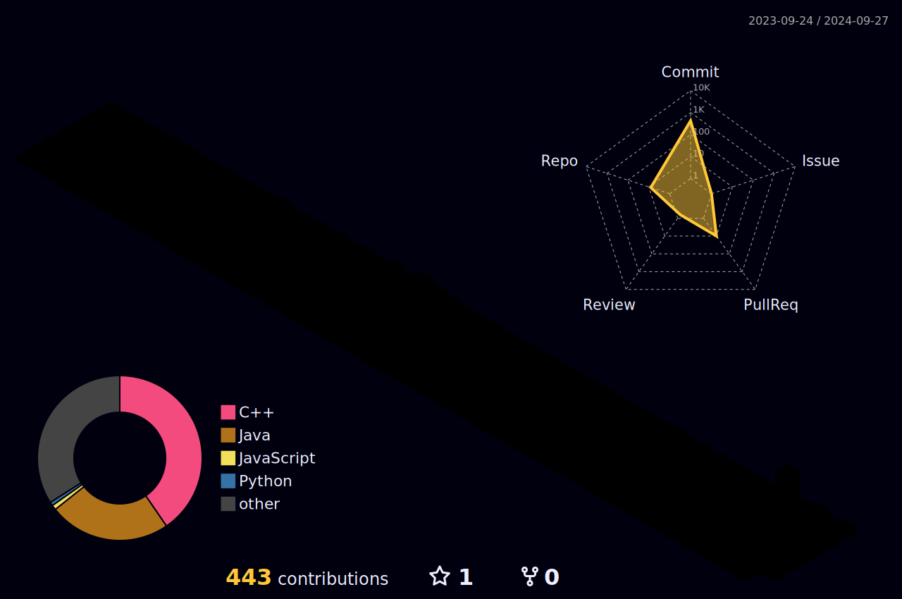

  

 
*밑바닥 까지 파고들기를 좋아하는 백엔드 개발자 지망생 입니다.*!(•̀ᴗ•́)و ̑̑
 
## ⚒️Tech Stack
<h3>Front End</h3>

<h3>Back End</h3>

<h3>DataBase</h3>

<h3>Server</h3>

<h3>Environment</h3>

<h3>Communication</h3>

  
## :two_men_holding_hands: TeamProject
딥러닝 AI를 이용한 자동 방향전환 전동휠체어 **"휙"** : https://github.com/DasomExpo (진행중)
 
 
숙소 기반 여행코스 추천 사이트 **"여가"** : https://github.com/TrabelMaker (진행중)

## :runner: SoloProject
 
 

  

<!--
**HuitaePark/HuitaePark** is a ✨ _special_ ✨ repository because its `README.md` (this file) appears on your GitHub profile.

Here are some ideas to get you started:

- 🔭 I’m currently working on ...
- 🌱 I’m currently learning ...
- 👯 I’m looking to collaborate on ...
- 🤔 I’m looking for help with ...
- 💬 Ask me about ...
- 📫 How to reach me: ...
- 😄 Pronouns: ...
- ⚡ Fun fact: ...
-->
